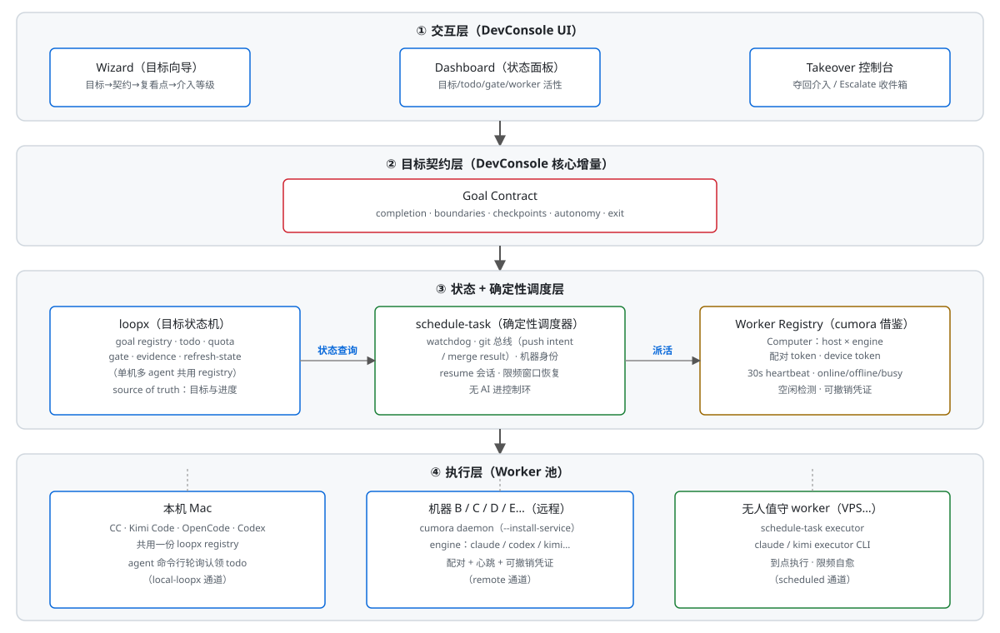
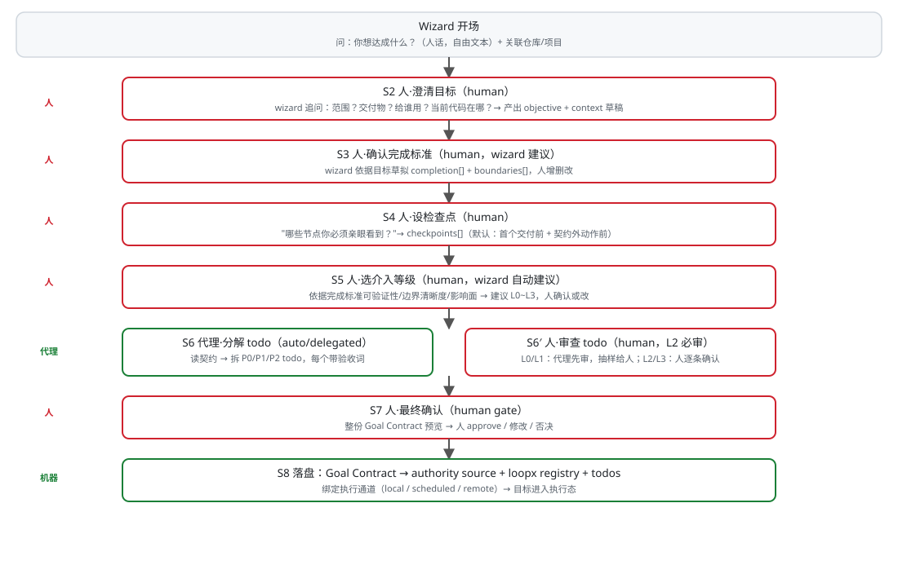
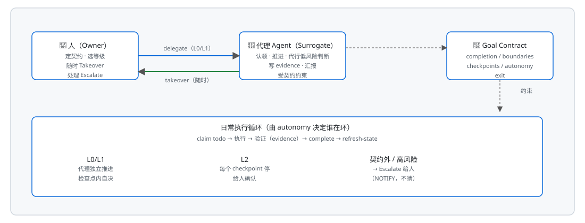
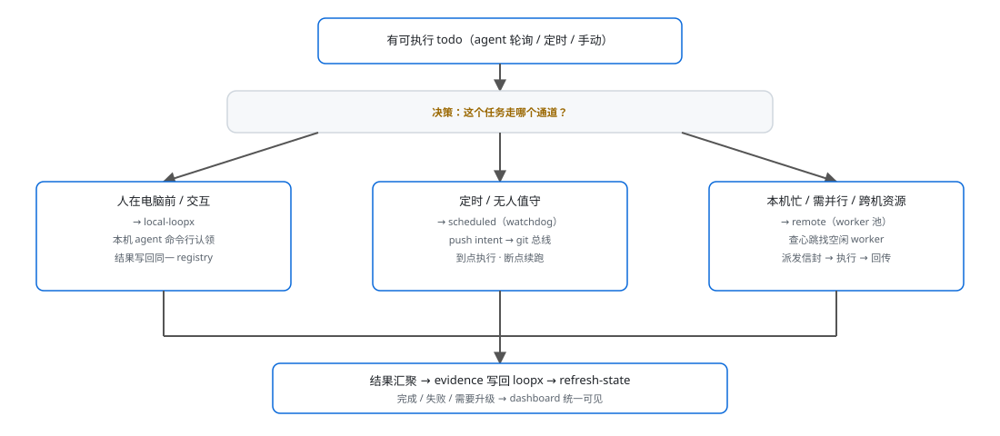

# 开发控制台（DevConsole）PRD

> 版本：v0.1（草稿） · 日期：2026-09-08 · 状态：待评审
> 作者：david + agent（Kimi Code）
> 定位：一份**可执行**的产品需求文档——整合 dev-loop / loopx / schedule-task / cumora BYOA 四套经验，产出一个带 **dashboard + wizard + 可控多机执行**的开发控制台。

---

## 目录

1. [一句话愿景](#1-一句话愿景)
2. [背景：四块拼图](#2-背景四块拼图)
3. [设计原则](#3-设计原则)
4. [核心概念模型](#4-核心概念模型)
5. [系统架构](#5-系统架构svg)
6. [关键流程](#6-关键流程svg)
7. [调度与执行模型](#7-调度与执行模型svg)
8. [数据模型](#8-数据模型)
9. [用户界面](#9-用户界面)
10. [里程碑](#10-里程碑)
11. [风险与缓解](#11-风险与缓解)
12. [验收标准](#12-验收标准)
13. [待决策问题](#13-待决策问题)

---

## 1. 一句话愿景

**一个让"人"用自然语言确立有界目标、由机器自动分解与执行、人在关键节点可控介入、并能在多台机器的多个 Agent 之间调度任务"的开发控制台。**

- 目标定义越精细 → 人介入越少（正反馈）
- 人不介入时 → 由"代理 Agent"代表你介入（而非无人管）
- 覆盖三种运行模式：本地交互 / 定时无人值守 / 跨机远程 worker

---

## 2. 背景：四块拼图

| 来源 | 形态 | 借鉴什么 | 不借鉴什么 |
|---|---|---|---|
| **dev-loop**（自研技能） | SKILL.md + dev-loop.sh | 人在环的 kickoff 讨论定目标；FEEDBACK/DECISIONS 纠偏闭环 | 无 UI；命令记忆负担重；状态文件脆弱 |
| **loopx** | Python CLI + registry + dashboard | goal/todo/gate/quota/evidence 状态机；单机多 agent 共用 registry；`--guided` 流程 | 目标级无完成契约；命令繁琐；跨机缺失 |
| **schedule-task**（smart-kind/schedule-task-skill） | SKILL.md + 零依赖 Node CLI + git 总线 | **确定性 watchdog**（无 AI 进控制环）；git 作唯一通道（push intent / merge result）；机器身份防竞态；resume 会话 | 技能形态非产品；无 dashboard；gate 只是散文 |
| **cumora BYOA** | 产品（server + daemon，npm 包） | **设备配对 + heartbeat + 可撤销凭证**；Computer 概念（机器在线/离线/忙碌）；多引擎适配（CC/Codex/OpenCode/pi…） | 它的 managed 云 brain；与我们的目标状态机无关的部分 |

**核心判断**：这四套不是四个平行"循环"，而是四层——**目标契约（缺）→ 状态机（loopx）→ 确定性调度（schedule-task）→ 跨机 worker（cumora）**。DevConsole = 最上层的"指挥 + 人机界面"，不是第五个循环。

---

## 3. 设计原则

1. **有界目标是一切的地基**：长时间运行的唯一护栏是"目标有明确的完成标准与边界"。无界目标 = 失控。
2. **目标精细度 ⇄ 介入需求成反比**：完成标准、检查点、边界定义得越清楚，机器越能自主；定义模糊处，机器必须升级给人。
3. **两级介入，而非二选一**：人不介入 ≠ 无人管——由"代理 Agent（Surrogate）"代表你介入；你要介入随时可以夺回（Takeover）。这是化解"确定性 vs 人在环"哲学冲突的方式。
4. **AI 不进控制环（调度确定性）**：派活、认领、超时、恢复由确定性调度器完成；AI 只负责"干活"与"建议"，不负责"决策是否该跑"。
5. **最小惊讶 / 默认只读**：任何写操作默认需要授权（人 OR 代理按契约授权）；生产动作永远升级给人。
6. **证据驱动**：每个 todo 完成必须带 evidence + 可复跑验证；状态可审计、可回滚。
7. **新增执行通道不改主流程**：loopx 本地 / schedule-task 定时 / cumora 远程 worker 是三个可插拔 adapter，统一走同一任务信封。

---

## 4. 核心概念模型

### 4.1 目标契约（Goal Contract）⭐ 本产品核心增量

loopx 的 goal 只有 objective 文本，**没有"什么算完成"**。DevConsole 在建立目标时强制产出结构化契约：

```yaml
goal:
  id:                  # 稳定 id
  objective:           # 一句话目标（人话）
  context:             # 背景、动机、约束
  completion:          # 完成标准（可验证，多条）← loopx 缺的
    - "…"
  boundaries:          # 边界（明确不做什么）
    - "…"
  checkpoints:         # 关键复看点（人/代理必须停的节点）
    - when: "…"
      who: human|surrogate|auto
      what: "确认…"
  autonomy:            # 介入等级（见 4.2）
  exit:                # 达成后动作：收尾 / 复盘 / 自动开下一目标
  authority_sources:   # 权威文档（设计/需求文件路径）
```

**产出物**：目标契约写入 goal 的 authority source（loopx 原生支持），agent 每轮先读它。

### 4.2 介入等级（Autonomy Ladder）

目标建立时由 wizard 引导人选择，或按契约精细度**自动建议**：

| 等级 | 名称 | 谁在环 | 适用 |
|---|---|---|---|
| L0 | **全自动（Auto）** | 无人在环；代理 Agent 全权按契约执行 | 契约极精细、低风险、可完全验证 |
| L1 | **代理代表（Delegated）** | 代理 Agent 代行日常判断；仅在**契约外/高影响**升级给人 | 默认档 |
| L2 | **人在环（Interactive）** | 每个 checkpoints 停给人确认；wizard 引导 | 目标模糊 / 高影响 / 用户想学 |
| L3 | **人全程（Manual）** | 每步都等人 | 探索期 / 教学 |

> **关键规则**：等级不是用户拍脑袋定死的——wizard 依据"完成标准是否可验证、边界是否清晰、影响面大小"建议等级；**契约越模糊，自动建议越偏向 L2**。

### 4.3 代理 Agent（Surrogate / Delegate）

"人不在场时的代表人"。不是自由 agent，而是**受目标契约约束的执行代理**：

- 职责：认领 todo、推进、在 L1 下代为通过**低风险检查点**、写 evidence、汇报
- 边界：只能行使契约授权的判断；**不能**改契约、不能做生产动作、不能越过 boundaries
- 升级（Escalate）：遇到契约未覆盖 / 高风险 / 需要新信息 → 停下，把人拉回来（NOTIFY），不猜
- 可撤销：人随时 Takeover，代理让位

### 4.4 执行通道（Execution Channel）——可插拔 adapter

统一任务信封（见 §7），三个 adapter 实现：

| 通道 | 触发 | 谁执行 | 何时用 |
|---|---|---|---|
| **local-loopx** | 人在会话里 / agent 轮询 | 本机任一 agent CLI（CC/Kimi/Codex/OpenCode） | 交互式、人在电脑前 |
| **scheduled** | schedule-task 确定性 watchdog（git 总线） | 本机或指定 worker 的 claude/kimi executor | 定时、无人值守、限频窗口恢复 |
| **remote** | cumora BYOA computer 配对 + heartbeat | 5 台机器上的 8 个 agent | 本机忙 / 任务可并行 / 需要跨机资源 |

### 4.5 Worker（执行者）

借鉴 cumora 的 Computer 概念统一建模：

- **Worker = 一台机器（Computer）× 一个引擎（agent CLI）**
- 属性：id、host、engine（claude-code/codex/kimi/opencode…）、status（online/offline/busy）、capabilities、pair token、device token、心跳时间
- 注册：`--pair` 一次性配对 → 常驻 daemon（`--install-service` 自愈）→ 30s heartbeat
- 空闲检测：central 侧聚合所有 worker 心跳 → wizard/dashboard 显示"谁空闲"

---

## 5. 系统架构（SVG）



---

## 6. 关键流程（SVG）

### 6.1 目标确立 Wizard（人在环主流程）



### 6.2 介入模型：Delegate / Takeover / Escalate



---

## 7. 调度与执行模型（SVG）

### 7.1 统一任务信封

所有执行通道消费**同一信封**（借鉴 schedule-task 的 envelope 思路 + loopx todo 语义）：

```yaml
task_envelope:
  envelope_id:      # 唯一
  goal_id:          # 所属目标
  todo_id:          # 对应 loopx todo
  title:            # 人话
  acceptance:       # 验收标准（可复跑命令/断言）
  channel:          # local-loopx | scheduled | remote
  worker:           # 目标 worker id（remote 时）
  timeout_min:      # 超时
  retry:            # 重试策略
  resume_session:   # schedule-task 风格断点续跑
  authority:        # 需要的写权限范围
  created_by:       # human | surrogate
```

### 7.2 调度选择流程



---

## 8. 数据模型

### 8.1 实体关系（草案）

```
Project 1───* Goal 1───* Todo
                  │
                  ├──1 GoalContract（completion/boundaries/checkpoints/autonomy/exit）
                  │
                  ├──* Evidence（todo 完成证据：命令输出/文件 diff/报告路径）
                  │
                  ├──* Gate（operator 决策记录：approve/reject/defer）
                  │
                  └──* TaskEnvelope（派发给执行通道的任务）
                          │
                          ├─── Worker 1───1 Computer（host）
                          │         └──1 Engine（claude-code/codex/kimi/opencode…）
                          │
                          └─── ScheduleSlot（watchdog 排期）
```

### 8.2 关键存储

| 数据 | 存哪 | 理由 |
|---|---|---|
| Goal/Todo/Evidence/Gate | loopx registry（`~/.codex/loopx` + 项目 `.loopx/`） | 复用成熟状态机 |
| Goal Contract | goal 的 authority source（项目内文档，入库） | 人可审、可版本化、agent 每轮读 |
| Worker/Computer 注册 | DevConsole 自己的 registry（借鉴 cumora `computers` 表） | loopx 无此概念 |
| 任务信封/排期 | DevConsole 的 git 总线或本地 state（借鉴 schedule-task `.schedule-tasks-data/`） | 确定性、可审计 |

---

## 9. 用户界面

### 9.1 Dashboard（Web，借鉴 loopx dashboard + cumora UI）

| 视图 | 内容 |
|---|---|
| Goals | 目标卡片：objective、进度（x/y todo done）、autonomy 等级、next action |
| Contract | 点开目标 → 看完整契约（completion/boundaries/checkpoints） |
| Workers | 所有 Computer：host × engine、online/offline/busy、当前任务、心跳时间 |
| Queue | 待派发信封、已派发、需升级（Escalate 收件箱） |
| Evidence | 每个 todo 的完成证据、可复跑验证 |
| Gates | 待人审批的 gate（approve/reject/defer） |

### 9.2 Wizard（TUI 或 Web 引导）

即 §6.1 流程。**关键：wizard 不是"填表"，是对话**——每个问题都解释"为什么问这个、怎么答能减少后续介入"。

### 9.3 Takeover / Escalate

- 任何时刻 dashboard 上"Takeover"按钮：人接管当前 todo，代理让位
- Escalate 收件箱：代理停下等人，附"它试了什么、卡在哪、需要什么决定"

---

## 10. 里程碑

### M0 · 概念验证切片（最小闭环，先做这个）
**目标**：证明"loopx 的一个 todo，能被外部 worker 领走执行并写回 evidence"。
- [ ] 本机：loopx goal + todo（现有 prismix 目标即可）
- [ ] DevConsole CLI 雏形：`devconsole dispatch <todo_id>` 生成任务信封
- [ ] 一个 worker adapter（先 local-loopx：信封 → 本机 agent 执行 → evidence 回写）
- [ ] 验证：todo 经信封完成，evidence 出现在 loopx
- **验收**：手动跑通一次 dispatch → 执行 → 回写闭环

### M1 · 目标契约 + Wizard v1
- [ ] Goal Contract schema + 校验器
- [ ] Wizard（TUI）：§6.1 S1→S8 全流程
- [ ] 契约落盘为 authority source + 自动建议 autonomy 等级
- [ ] checkpoints 机制：执行到检查点停/放行（L0~L3 语义生效）
- **验收**：用 wizard 建一个新目标，契约完整落盘；L2 下 checkpoint 正确停人

### M2 · Dashboard + Delegate/Takeover
- [ ] Dashboard v1（Goals/Contract/Evidence/Gates 视图）
- [ ] Surrogate 代理角色：L1 代行低风险检查点
- [ ] Escalate 收件箱 + Takeover
- [ ] loopx registry 双向同步展示
- **验收**：L1 目标无人值守推进 3+ todo；中途人 Takeover 成功；契约外动作正确 Escalate

### M3 · 多通道调度（schedule-task + cumora 借鉴）
- [ ] scheduled 通道 adapter（接 schedule-task watchdog 或移植其确定性调度）
- [ ] Worker Registry：Computer 模型 + 配对（`--pair`）+ 心跳 + 活性
- [ ] remote 通道 adapter：空闲检测 → 派发 → 回传
- [ ] 三通道统一信封 + dashboard 聚合
- **验收**：一台远程机器注册为 worker，一个 todo 被派过去执行并回写 evidence

### M4 · 打磨
- [ ] 限频/超时/重试/断点续跑（借鉴 schedule-task resume）
- [ ] 权限模型细化（写范围/生产动作升级）
- [ ] 复盘视图（借鉴 dev-loop FEEDBACK/DECISIONS）

---

## 11. 风险与缓解

| 风险 | 等级 | 缓解 |
|---|---|---|
| 目标契约写不好 → gap（Goodhart） | 高 | 检查点机制 + Escalate + Takeover 兜底；不追求契约完美，靠"人校准点位置正确" |
| 远程 worker 不可信 / 凭证泄露 | 高 | cumora 式设备级可撤销凭证；最小权限 JWT；只授权本机所属 agent |
| 三通道状态分裂（同一 todo 两处跑） | 中 | loopx registry 为唯一事实源；信封幂等 + 认领锁（借鉴机器身份防竞态） |
| 范围蔓延（又想做一个大平台） | 中 | 严格按 M0→M4；M0 不通过不进入 M1 |
| agent 在 L0 越权 | 中 | 代理只行使契约授权；生产动作永远升级给人 |
| 与 loopx/schedule-task/cumora 上游漂移 | 低 | 只做 adapter 层，不 fork 核心；接口薄 |

---

## 12. 验收标准（总）

1. 用自然语言经 wizard 建立一个**有界目标**，契约含 completion/boundaries/checkpoints/autonomy。
2. 该目标能分解为带验收词的 todo，并进入 loopx registry。
3. L1 下无人值守推进，检查点按契约停/放；契约外动作 Escalate 给人。
4. 人随时 Takeover 且能看清现场（evidence/日志）。
5. 任务可经三种通道之一执行（local/scheduled/remote），结果统一回写同一事实源。
6. 至少一台远程机器可作为 worker 注册、被发现空闲、被派活、回传结果。
7. dashboard 可看到：目标进度、worker 活性、待审批 gate、evidence。

---

## 13. 待决策问题

1. **技术栈**：DevConsole 主体用什么？(a) Node/TS（与 cumora、schedule-task 一致）；(b) Python（与 loopx 一致）；(c) 混合（UI 用 web 框架，CLI 薄）。倾向 (a)+(c)。
2. **与 cumora 的关系**：DevConsole 直接调用 cumora server API 当 worker 池用？还是借鉴其协议自建 Worker Registry？→ 倾向"调用 cumora 当后端"，除非 cumora 授权模型不匹配。
3. **与 schedule-task 的关系**：直接复用 schedule-task CLI（git 总线）？还是移植其 watchdog 进 DevConsole？→ 倾向直接复用，少造轮子。
4. **loopx 目标级"完成契约"缺失**：M1 先用 authority source 承载（不 fork loopx）；是否值得向上游提 completion_criterion 需求？
5. **UI 形态**：Web dashboard（loopx 已有 dashboard 可借鉴）还是 TUI？wizard 用 TUI 还是 Web？用户最初说"TUI wizard 也可以"。
6. **产品名**：DevConsole 是占位名，待定。

---

*— 草稿结束。请评审：整体结构、介入模型、里程碑切分、待决策问题。*
